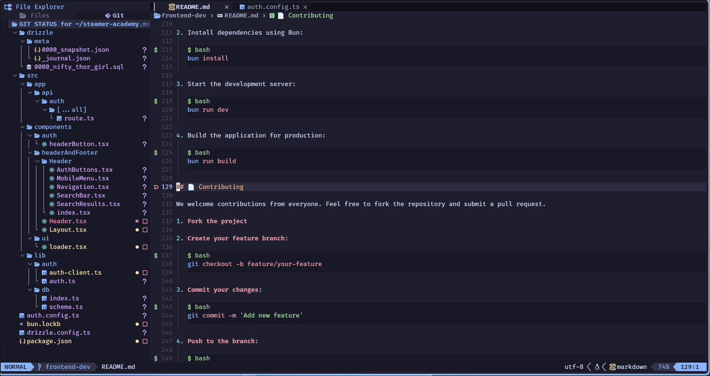
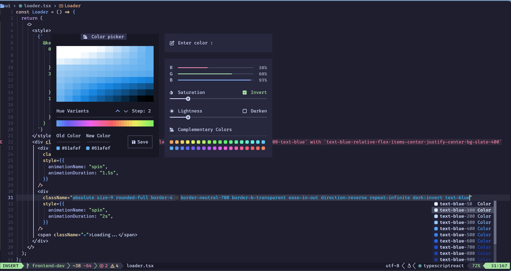
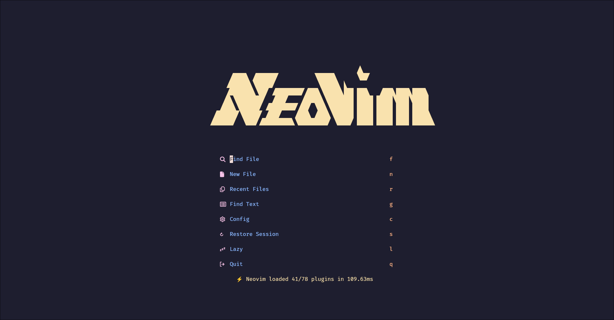
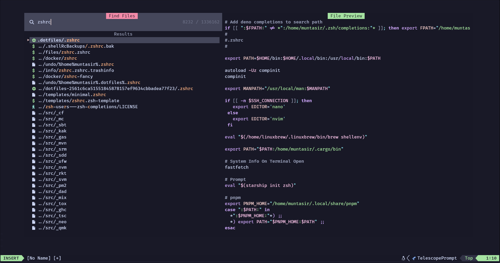
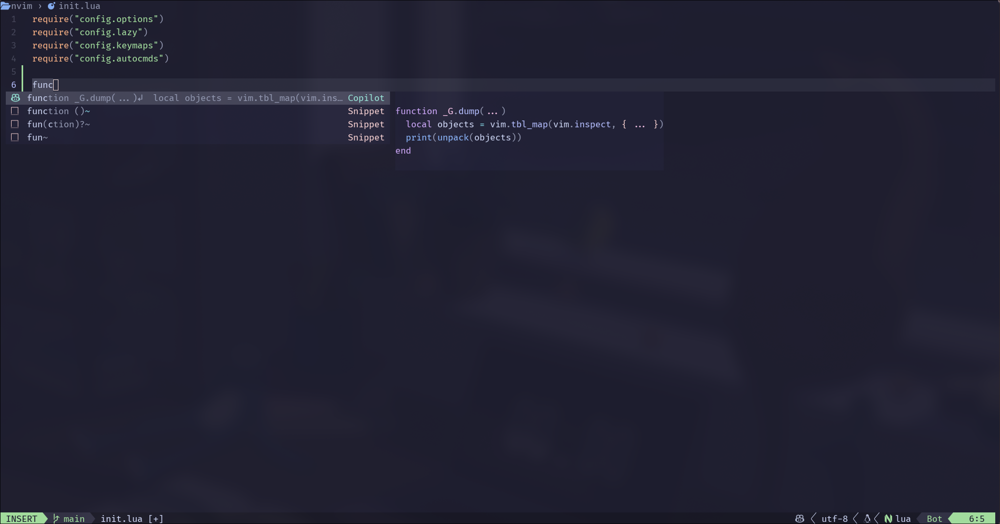
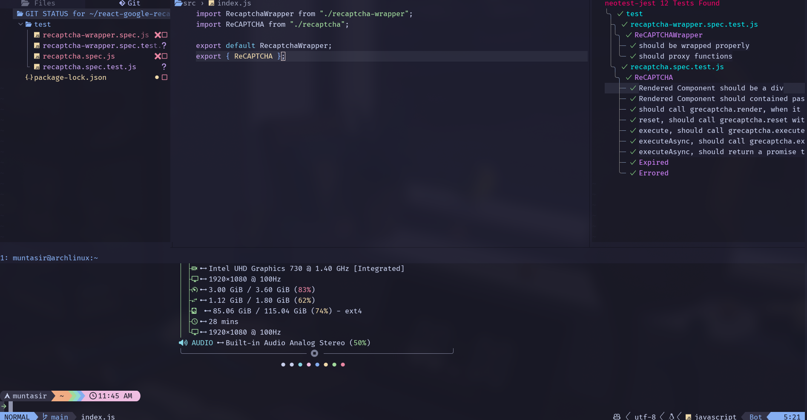

<h3 align="center"></h3>

## Table Of Contents
<!--toc:start-->
- [:sparkles: Features Supported](#sparkles-features-supported)
- [:eyes: Showcase](#eyes-showcase)
- [:zap: Requirements](#zap-requirements)
- [:file_folder: File Structure](#file_folder-file-structure)
- [:rocket: Getting Started](#rocket-getting-started)
- [:wave: Credits](#wave-credits)
<!--toc:end-->
## :sparkles: Features Supported

- ⚡ The following languages and all other language support
  - Rust
  - HTML
  - Css
  - Tailwind
  - JavaScript
  - TypeScript
  - Lua
- 📦 Linters and static analysis through [none-ls](https://github.com/nvimtools/none-ls.nvim) and [mason.nvim](https://github.com/williamboman/mason.nvim)
- 🥂 Lsp servers configured with [nvim-lspconfig](https://github.com/neovim/nvim-lspconfig)
- 🧹 Autocompletion using the new [blink.cmp](https://github.com/saghen/blink.cmp)
- ⚒️ Testing using the fantastic [neotest](https://github.com/nvim-neotest/neotest) plugin
- 💫 Treesitter syntax highlighting
- 💤 Easily customize and extend config
- 🎨 A theme switcher using [themery.nvim](https://github.com/zaldih/themery.nvim)
- 📷 Take code screenshots using [nvim-silicon](https://github.com/michaelrommel/nvim-silicon)
- 🚀 Blazingly fast using [💤 lazy.nvim](https://github.com/folke/lazy.nvim)

## :eyes: Showcase

|  |  |
| ------- | ------- |
|  |  |
|  |  |

## :file_folder: File Structure

<details>

<summary> </summary>

```
    📂 ~/.config/nvim
    ├── 📂 lua
    │  └── 📂 config
    │  │   ├──  autocmds.lua
    │  │   ├──  keymaps.lua
    │  │   ├──  lazy.lua
    │  │   └──  options.lua
    │  └── 📂 custom
    │  │   └──  telescope-preview.lua
    │  └── 📂 plugins
    │      ├──  ai.lua
    │      ├──  annotations.lua
    │      ├──  auto-save.lua
    │      ├──  autopairs.lua
    │      ├──  autotag.lua
    │      ├──  bufferline.lua
    │      ├──  completions.lua
    │      ├──  context.lua
    │      ├──  cursor-highlight.lua
    │      ├──  dap.lua
    │      ├──  database.lua
    │      ├──  flash.lua
    │      ├──  git.lua
    │      ├──  grug-far.lua
    │      ├──  harpoon.lua
    │      ├──  icons.lua
    │      ├──  img-clip.lua
    │      ├──  indent-guides.lua
    │      ├──  lazydev.lua
    │      ├──  live-server.lua
    │      ├──  live-share.lua
    │      ├──  lsp.lua
    │      ├──  markdown.lua
    │      ├──  mdx.lua
    │      ├──  mini-textobjects.lua
    │      ├──  neogit.lua
    │      ├──  neotest.lua
    │      ├──  neotree.lua
    │      ├──  noice.lua
    │      ├──  nvchad.lua
    │      ├──  persistance.lua
    │      ├──  rust.lua
    │      ├──  screenshots.lua
    │      ├──  snacks.lua
    │      ├──  snippets.lua
    │      ├──  statusline.lua
    │      ├──  tailwind.lua
    │      ├──  telescope.lua
    │      ├──  theme.lua
    │      ├──  todo-comments.lua
    │      ├──  treesitter.lua
    │      ├──  trouble.lua
    │      ├──  ts-comments.lua
    │      ├──  undotree.lua
    │      ├──  vim-tmux-navigation.lua
    │      ├──  which-key.lua
    │      └──  yanky.lua
    │
    ├──  init.lua
    ├──  lazy-lock.json
    └──  README.md
```

- The [lua/config](./lua/config/) directory contains all of neovims autocommands, keymaps, [lazy.nvim](https://github.com/folke/lazy.nvim) config, and options.
- The [lua/plugins](./lua/plugins/) directory contains all plugin specific configuration.
- The [lazy-lock.json](./lazy-lock.json) is lazy.nvim package managers lockfile.
- The [images](./images) directory contains the images that are showcased above.
- The [init.lua](./init.lua) file is the starting point for the neovim configuration.
- The [Custom](./lua/custom) directory contains custom configurations for plugins.

</details>

## :zap: Requirements

- [Neovim](https://github.com/neovim/neovim) >= **0.9.0** (needs to be built with **LuaJIT**)
- [Imagemagick](https://imagemagick.org/index.php)  (required, for [image.nvim](https://github.com/3rd/image.nvim))
- [Python](https://www.python.org/) (required, for [image.nvim](https://github.com/3rd/image.nvim))
- [git](https://git-scm.com) >= **2.40.0** (Gitsigns)
- A [Nerd Font](https://www.nerdfonts.com/) (Important, Otherwise icons won't show.)
- [Silicon](https://github.com/Aloxaf/silicon) cli tool (Optional, see [screenshots.lua](./lua/plugins/screenshots.lua))
- [Gnu Stow](https://github.com/aspiers/stow) for symlinking (optional, can be done manually)
- Github CLI [gh](https://github.com/cli/cli) for [gh.nvim](https://github.com/ldelossa/gh.nvim) (optional, if you use Github)

## :rocket: Getting Started

1. Clone this repository

```sh
git clone https://github.com/MuntasirSZN/dotfiles
```

2. If you have any configurations present, move it into backup.

```sh
mv ~/.config/nvim ~/.config/nvim.bak
```

3. Make the symlinks using [stow](https://github.com/aspiers/stow)

```sh
stow neovim
```

4. Open Neovim And Enjoy !

```sh
nvim
```

## :wave: Credits

- Huge credits to [@folke](https://github.com/folke), his neovim distribution was my learning source. Link -> [💤Lazyvim](https://github.com/LazyVim/LazyVim)
- Also, huge credits to [@siduck](https://github.com/siduck), the creator of the amazing [Nvchad](https://github.com/NvChad/NvChad), his plugins and distribution is amazing, and my source of inspiration
- Big Shout Out to the creators of the various plugins which make neovim the editor we use today.
- Also, the people that actually made this editor.
